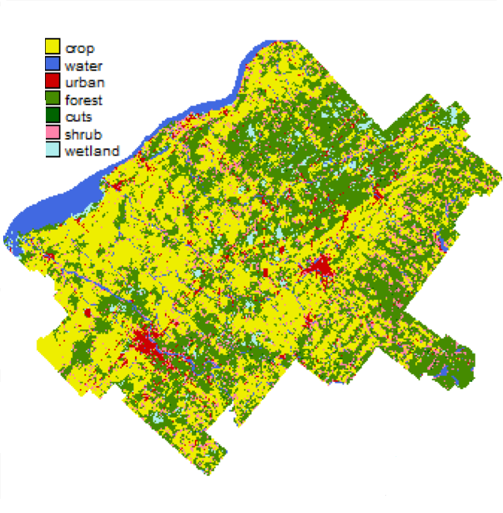

# REDEFINE_project
======

Project Aim: "Combine dynamic landscape models with network theory for evaluating resiliance to global changes in frangmented forested landscapes"
Participants: Marco Mina, Núria Aquilué, Matthew Duveneck, Marie-Josée Fortin, and Christian Messier. Repository maintained by Marco Mina

-------

Updated on Mar 22 2019

-------

### General description

This repository contains input files and documentation for running LANDIS-II/PnET in Quebec

-----------

### Study area

The study area is located in the administrative region of the Centre-du-Québec (Fig. 1). It is a rural landscape situated in Southern Quebec in which forest patches are intermixed with agricultural land and urban areas. 

-----------  

#### Figure 1

  
-----------
