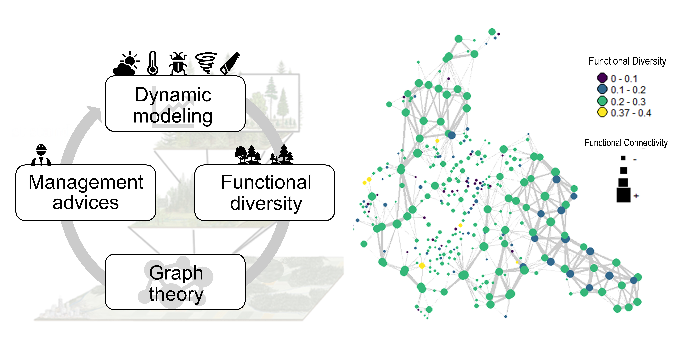

# REDEFiNE - REsilience Diversity landscapE Forest NEtwork 

**Project Aim**: "Combine dynamic landscape models with network theory for evaluating resilience to global changes in fragmented forested landscapes".
**Participants**: Marco Mina, Núria Aquilué, Matthew Duveneck, Marie-Josée Fortin, and Christian Messier. 
**Funding**: Canada Research Chair in Forest Resilience to Global Change (*C. Messier, N. Aquilué, M. Mina*); Swiss National Science Foundation (Postdoc.Mobility fellowship, *M.Mina*)

-----------  

-------

### General description

This repository contains 
 - LANDIS-II/PnET-Succession input files and documentation for running the model in the Centre-du-Quebec
 - Installers of LANDIS-II and its extension used in studies and as supporting dato to published papers
 - Tools and R scripts to build and analyze forest landscapes as a functional complex network
 - Scripts and data to share

-----------

### Study area

The study area is located in the administrative region of the Centre-du-Québec. It is a rural landscape situated in Southern Quebec in which forest patches are intermixed with agricultural land and urban areas. 

  
-----------

Repository maintained by **Marco Mina**  `marco.mina[at]eurac.edu`
